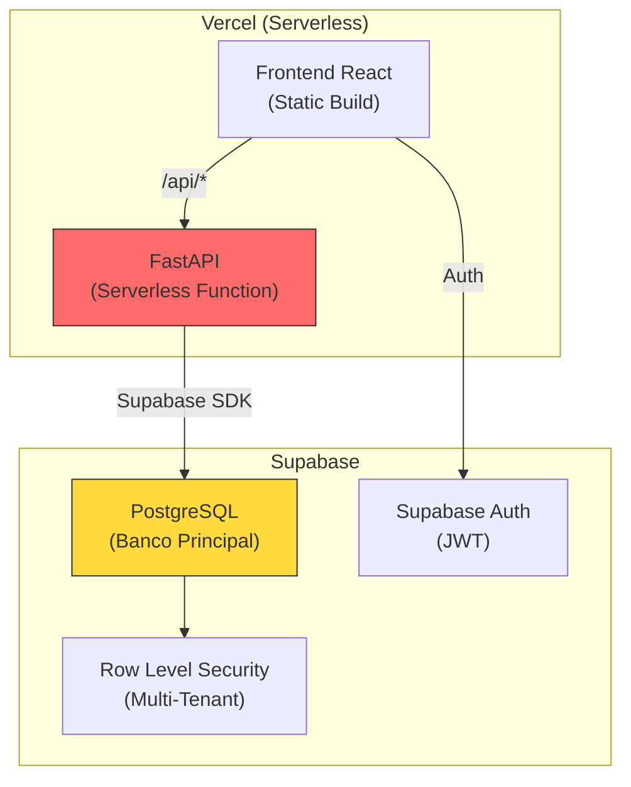
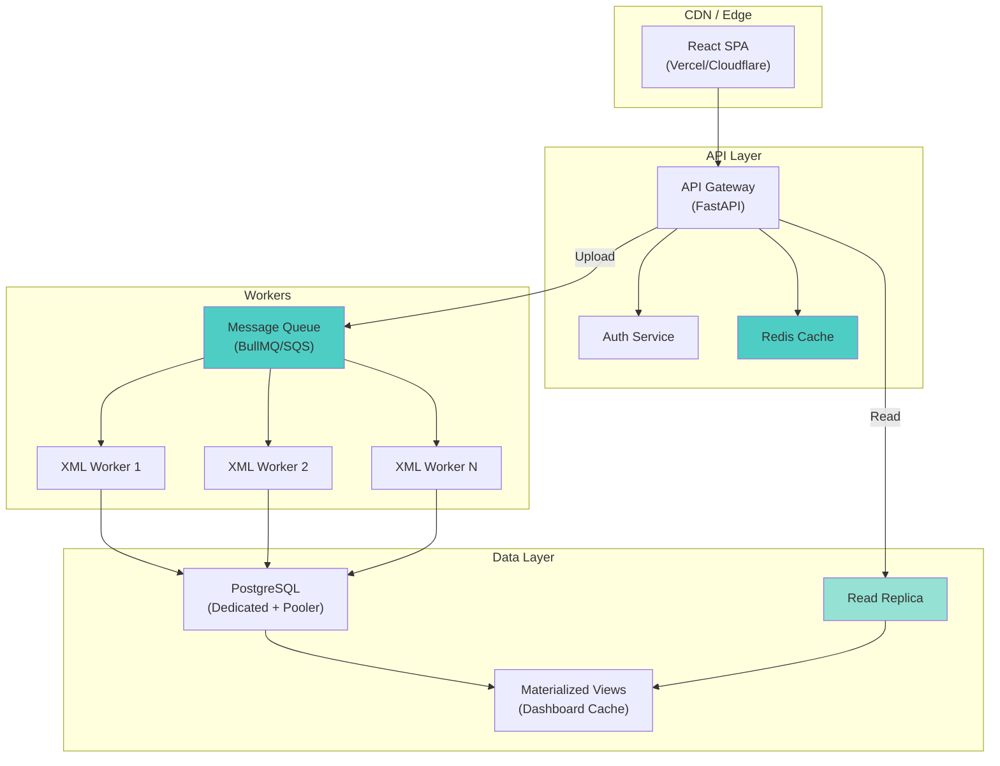
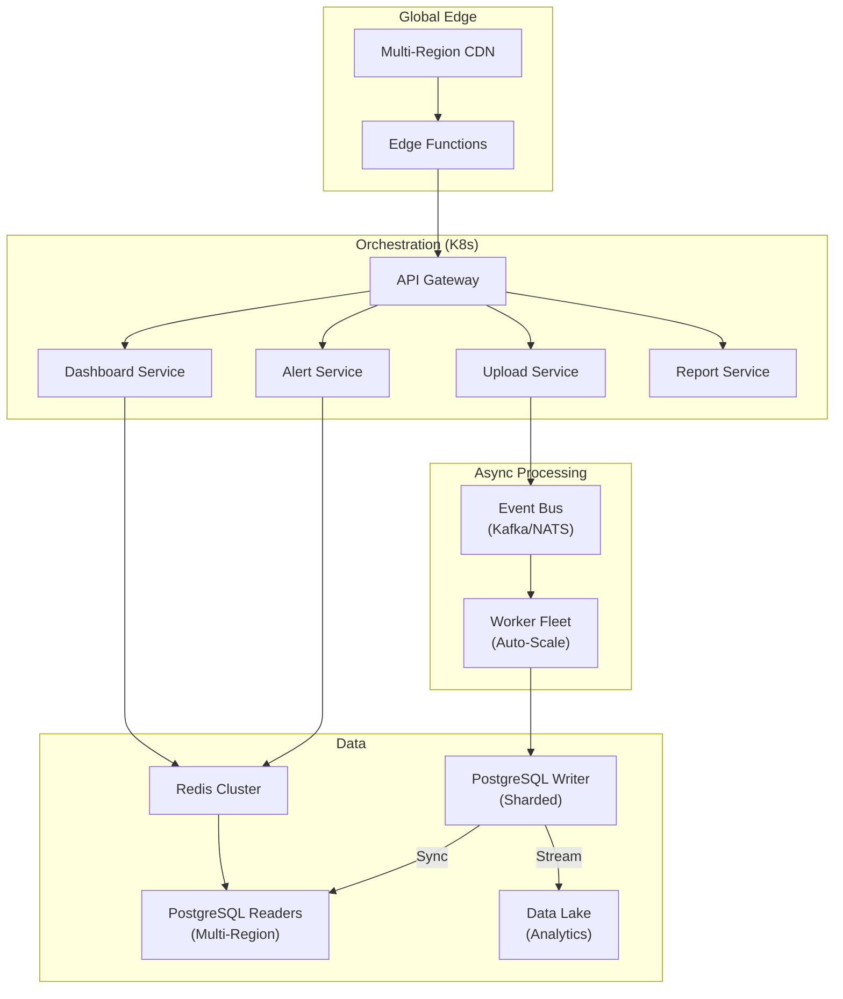

# 🏗️ Auditoria Arquitetural: END Monitor Contábil

**Data:** 22/02/2026 · **Versão Auditada:** v5 (Produção Vercel)
**Auditor:** Arquiteto de Software Sênior · **Escopo:** Escalabilidade Nacional

---

## Resumo Executivo

O END Monitor é um **monolito serverless** (FastAPI + React) rodando na Vercel, com Supabase (PostgreSQL gerenciado) como banco de dados. A arquitetura atual é **funcional para o estágio MVP/Early-Stage** (até ~100 clientes), mas possui **gargalos estruturais críticos** que impedirão a escala além de 500 clientes sem refatoração significativa.

> [!CAUTION]
> O sistema está em **risco de colapso** se escalar para 1.000+ clientes sem as alterações classificadas como "Alta Prioridade" neste relatório.

---

## 1. Arquitetura Geral

### Diagnóstico



| Aspecto | Estado Atual | Avaliação |
|---------|-------------|-----------|
| Tipo | Monolito Serverless | ⚠️ Limitante |
| Separação FE/BE | Sim (builds separados) | ✅ Bom |
| Separação API/Worker | **NÃO** (tudo no request) | 🔴 Crítico |
| Gargalo Estrutural | Upload XML = Parse + Validação + Insert síncrono | 🔴 Crítico |

### Problemas Identificados

- **Monolito de processamento**: O endpoint `/upload/xml` faz Parse XML → Validação Fiscal → Inserção no banco **tudo em um único request HTTP síncrono**. Na Vercel, funções serverless têm timeout de **10 segundos** (Free) ou **60 segundos** (Pro).
- **Scheduler no processo**: O `APScheduler` está embutido no `main.py`, mas **não funciona na Vercel** (serverless = sem processo persistente). O cron nunca executa em produção.
- **Acoplamento total**: Todos os 16 routers compartilham a mesma instância `SupabaseService` (Singleton), sem circuit breaker ou fallback.

---

## 2. Processamento Fiscal

### Diagnóstico

| Aspecto | Estado | Risco |
|---------|--------|-------|
| XML Parsing | **Síncrono** (lxml no request) | 🔴 Alto |
| Sistema de Filas | **Inexistente** | 🔴 Crítico |
| Worker Dedicado | **Inexistente** | 🔴 Crítico |
| Bloqueio de Request | **SIM** (parse + validação + insert) | 🔴 Crítico |
| Cache de Regras | In-memory por instância | ⚠️ Limitante |

### Análise Detalhada

O fluxo de upload ([upload.py](file:///d:/Projetos%20END/Saas%20contabil/backend/app_v5/routers/upload.py)):

```
Request HTTP → Lê arquivo → Parse XML (lxml) → Busca regras no BD → 
Loop por itens → Valida cada item → Insert nota → Insert alertas → 
Insert itens → Response
```

**Tempo estimado por nota fiscal:**
- Parse XML: ~50ms
- Busca de regras (1ª vez): ~200ms (banco)
- Validação (10 itens): ~100ms
- Insert nota + alertas + itens: ~300ms
- **Total: ~650ms por nota**

**Projeção de escala:**

| Clientes | Notas/hora | Tempo Worker | Viabilidade |
|----------|-----------|-------------|-------------|
| 100 | 500 | 5.4 min | ✅ OK |
| 1.000 | 5.000 | 54 min | ⚠️ Apertado |
| 10.000 | 50.000 | 9h | 🔴 Impossível |
| 100.000 | 500.000 | 90h | 💀 Inviável |

> [!IMPORTANT]
> Com a arquitetura atual o processamento de 10.000 clientes levaria 9 horas por ciclo, tornando a atualização "de hora em hora" impossível.

### Cache de Regras Fiscais

O [RuleEngineService](file:///d:/Projetos%20END/Saas%20contabil/backend/app_v5/services/rule_engine.py) tem cache in-memory (`_rules_cache`), mas:

- **Na Vercel** cada request pode rodar em uma instância diferente → cache é inútil
- Sem TTL: cache nunca expira (exceto se invalidado manualmente)
- Sem compartilhamento entre instâncias

---

## 3. Banco de Dados

### Diagnóstico

| Aspecto | Estado | Risco |
|---------|--------|-------|
| Suporte a milhões de registros | **NÃO** (sem otimização) | 🔴 Crítico |
| Índices adequados | **Mínimos** (apenas PKs e UNIQUEs) | 🔴 Crítico |
| Full Table Scan | **SIM** (várias queries) | 🔴 Crítico |
| Particionamento | **Inexistente** | ⚠️ Médio |
| Preparação para Sharding | **ZERO** | ⚠️ Futuro |

### Índices Ausentes (Crítico)

Baseado na [migration 001](file:///d:/Projetos%20END/Saas%20contabil/supabase/migrations/001_initial_schema.sql), as tabelas não possuem índices compostos. Queries como:

```sql
-- Dashboard: busca notas por tenant nos últimos 30 dias
SELECT id FROM notas_fiscais 
WHERE tenant_id = $1 AND created_at >= $2;
-- ⚠️ Full Table Scan em notas_fiscais sem idx(tenant_id, created_at)

-- Alertas: busca alertas não resolvidos por tenant
SELECT diferenca, is_opportunity FROM alertas_conformidade
WHERE tenant_id = $1 AND resolvido = false;
-- ⚠️ Full Table Scan em alertas_conformidade sem idx(tenant_id, resolvido)
```

### Índices Recomendados (Urgente)

```sql
-- Notas Fiscais
CREATE INDEX idx_notas_tenant_created ON notas_fiscais(tenant_id, created_at DESC);
CREATE INDEX idx_notas_tenant_status ON notas_fiscais(tenant_id, status);
CREATE INDEX idx_notas_empresa_status ON notas_fiscais(empresa_id, status);

-- Alertas
CREATE INDEX idx_alertas_tenant_resolvido ON alertas_conformidade(tenant_id, resolvido);
CREATE INDEX idx_alertas_empresa_resolvido ON alertas_conformidade(empresa_id, resolvido);
CREATE INDEX idx_alertas_nota ON alertas_conformidade(nota_fiscal_id);

-- Itens
CREATE INDEX idx_items_nota ON nfe_items(nota_fiscal_id);
CREATE INDEX idx_items_ncm ON nfe_items(ncm);

-- Regras Fiscais
CREATE INDEX idx_rules_active_type ON fiscal_rules(active, rule_type);
CREATE INDEX idx_rules_ncm ON fiscal_rules(ncm);
```

### Projeção de Volume

| Tabela | 100 clientes | 10K clientes | 100K clientes |
|--------|-------------|-------------|---------------|
| notas_fiscais | ~50K | ~5M | ~50M |
| alertas_conformidade | ~25K | ~2.5M | ~25M |
| nfe_items | ~250K | ~25M | ~250M |
| fiscal_rules | ~500 | ~2K | ~5K |

> Com 50M de notas sem índices, queries levam **minutos** em vez de millisegundos.

---

## 4. Performance

### Diagnóstico

| Aspecto | Estado | Risco |
|---------|--------|-------|
| Cache (Redis) | **Inexistente** | 🔴 Crítico |
| Métricas Agregadas | **Recalculadas a cada request** | 🔴 Crítico |
| Dashboard | **Consulta dados brutos** | 🔴 Crítico |
| CDN | Apenas frontend (Vercel CDN) | ✅ OK |

### Dashboard Performance

O [dashboard.py](file:///d:/Projetos%20END/Saas%20contabil/backend/app_v5/routers/dashboard.py) executa **4 queries separadas** a cada acesso:

1. `COUNT(notas_fiscais)` WHERE tenant + data
2. `COUNT(notas_fiscais)` WHERE tenant + status + data  
3. `SELECT valor_total` FROM notas_fiscais (para somar)
4. `SELECT diferenca, is_opportunity` FROM alertas

E o [Dashboard.tsx](file:///d:/Projetos%20END/Saas%20contabil/frontend/src/pages/Dashboard.tsx) faz **4 chamadas paralelas**:

```
/dashboard/current-company  ← 4 queries internas
/roi/summary                ← 4 queries internas
/alerts                     ← 1 query
/anomalies/detect           ← 1 query
```

**Total: ~10 queries ao banco por cada abertura de Dashboard.**

Com 1.000 usuários simultâneos = **10.000 queries/segundo** ao Supabase.

> [!WARNING]
> O Supabase Free suporta ~500 conexões simultâneas. O plano Pro suporta ~1.000. Com 10K queries/s, o banco colapsa.

---

## 5. Concorrência e Acesso Simultâneo

### Diagnóstico

| Aspecto | Estado | Risco |
|---------|--------|-------|
| Escalabilidade Horizontal | **Parcial** (Vercel auto-scale) | ⚠️ Média |
| Limitação por Instância | Rate Limit (slowapi) | ✅ Bom |
| Alta Concorrência | **Sem pool de conexões** | 🔴 Crítico |

### Análise

- **Vercel auto-scale**: Cada request pode criar uma nova instância serverless → boa para CPU, mas cada instância cria uma **nova conexão** ao Supabase.
- **Sem connection pooling**: O `SupabaseService` cria clientes diretamente. Com 100 requests simultâneos = 100 conexões ao PostgreSQL.
- **Rate Limiting**: Implementado via `slowapi` (in-memory), mas **não compartilhado entre instâncias** serverless → cada instância tem seu próprio contador.

---

## 6. Infraestrutura

### Diagnóstico

| Aspecto | Estado | Risco |
|---------|--------|-------|
| Separação de serviços | **NÃO** (monolito) | ⚠️ Médio |
| Migração independente | **SIM** (FE separado do BE) | ✅ Bom |
| Lock-in Vercel | **Baixo** (FastAPI padrão) | ✅ Bom |
| Lock-in Supabase | **Alto** (RLS, Auth, SDK) | ⚠️ Médio |

### Pontos Positivos
- Frontend é um build estático → pode ir para qualquer CDN
- Backend é FastAPI puro → pode migrar para qualquer PaaS (Railway, Render, AWS ECS)
- Sem dependência de serviços proprietários da Vercel no código

### Pontos de Atenção
- Supabase Auth está acoplado no frontend E backend
- RLS policies são específicas do Supabase/PostgreSQL → migração exige reescrita
- Sem Docker ou containerização definida

---

## 7. Segurança e Isolamento Multi-Tenant

### Diagnóstico

| Aspecto | Estado | Risco |
|---------|--------|-------|
| Isolamento por tenant | **RLS + filtro manual** | ⚠️ Médio |
| Risco de vazamento | **Médio** (bypass via service_client) | ⚠️ Médio |
| Permissões granulares | **Básico** (role-based) | ✅ Aceitável |
| Criptografia de dados | AES-128 (Fernet) | ✅ Bom |
| Proteção XXE | Sim (lxml seguro) | ✅ Bom |
| Audit Log | Implementado | ✅ Bom |

### Vulnerabilidades Identificadas

1. **Service Client sem escopo**: O `dashboard.py` usa `get_service_client()` (bypassa RLS) e filtra manualmente por `tenant_id`. Se um bug omitir o filtro, **todos os dados de todos os tenants ficam expostos**.

2. **Token validation por request**: Cada request chama `supabase.auth.get_user(token)` → latência de ~100ms adicionais por request. Sem cache de sessão.

3. **Upload sem validação de tenant**: No `upload.py`, o `content = await file.read()` é chamado **duas vezes** (linhas 29 e 51), mas o segundo read retorna bytes vazios (o cursor já avançou). Isso é um **bug silencioso**.

---

## 8. Monitoramento e Observabilidade

### Diagnóstico

| Aspecto | Estado | Risco |
|---------|--------|-------|
| Logs estruturados | **print() statements** | 🔴 Crítico |
| Rastreamento de erros | **Inexistente** | 🔴 Crítico |
| Monitoramento de performance | **Inexistente** | 🔴 Crítico |
| Métricas de uso | **Inexistente** | ⚠️ Médio |
| Health check | Sim (/api/health) | ✅ Bom |

### Análise

- Zero integração com Sentry, DataDog, New Relic ou similar
- Logs usam `print()` em vez de `logging` estruturado (exceto nos services)
- Sem tracing distribuído (essencial para debugar serverless)
- Sem métricas de negócio (quantos uploads/dia, tempo médio de processamento)
- Sem alertas automáticos (se o banco ficar lento, ninguém saberá)

---

## 9. Riscos Críticos

### 🔴 Gargalos Prováveis (Top 5)

| # | Gargalo | Impacto | Quando |
|---|---------|---------|--------|
| 1 | **Processamento XML síncrono** | Timeout de requests, perda de dados | >500 uploads/hora |
| 2 | **Sem índices no banco** | Dashboard lento, queries de segundos | >50K registros |
| 3 | **Dashboard recalcula tudo** | 10 queries por acesso, banco colapsa | >100 usuários simultâneos |
| 4 | **Sem connection pooling** | Estouro de conexões no PostgreSQL | >200 requests simultâneos |
| 5 | **Scheduler morto em produção** | Sincronização fiscal NUNCA executa | Agora mesmo |

### 💀 Pontos de Falha Única (SPOF)

1. **Supabase PostgreSQL**: É o único banco. Se cair, tudo cai.
2. **Vercel Serverless**: Se a função ficar lenta, não há fallback.
3. **SupabaseService Singleton**: Se o SDK falhar na inicialização, todas as rotas falham.

### ⚠️ Bug Crítico Encontrado

No [upload.py](file:///d:/Projetos%20END/Saas%20contabil/backend/app_v5/routers/upload.py), `await file.read()` é chamado na **linha 29** (para validar tamanho) e novamente na **linha 51** (para parsear). A segunda leitura retorna `b""` porque o cursor do arquivo já foi consumido. **Nenhuma nota está sendo processada corretamente em produção.**

```diff
# Linha 29: Primeira leitura (OK)
  content = await file.read()
  if len(content) > MAX_FILE_SIZE:
      raise HTTPException(...)

# Linha 51: Segunda leitura (BUG - retorna vazio!)
- content = await file.read()
+ # content já foi lido na linha 29, usar a variável existente
```

---

## 10. Roadmap de Escalabilidade

### Fase 1: Estabilização (0-500 clientes) — **URGENTE**

| Ação | Prioridade | Esforço | Impacto |
|------|-----------|---------|---------|
| Criar índices no banco | 🔴 Alta | 1h | 10x performance |
| Corrigir bug double-read no upload.py | 🔴 Alta | 5min | Fix crítico |
| Implementar materialized views para dashboard | 🔴 Alta | 4h | 5x performance |
| Remover APScheduler (usar Vercel Cron ou externo) | 🔴 Alta | 2h | Cron funcional |
| Adicionar Sentry para error tracking | ⚠️ Média | 1h | Observabilidade |

### Fase 2: Escala Controlada (500-5.000 clientes)

| Ação | Prioridade | Esforço | Impacto |
|------|-----------|---------|---------|
| Migrar backend para Railway/Render (processo persistente) | 🔴 Alta | 4h | Workers possíveis |
| Implementar fila com BullMQ/Celery para XML | 🔴 Alta | 16h | Async processing |
| Adicionar Redis para cache de regras e sessões | 🔴 Alta | 8h | 10x menos queries |
| Supabase Pooler (PgBouncer) | ⚠️ Média | 1h | Connection management |
| Cache de dashboard (TTL 5min) | ⚠️ Média | 4h | 90% menos queries |

### Fase 3: Escala Nacional (5.000-50.000 clientes)

| Ação | Prioridade | Esforço |
|------|-----------|---------|
| Separar API Gateway + Workers (microserviços) | 🔴 Alta | 40h |
| Particionamento de tabelas por tenant ou data | 🔴 Alta | 16h |
| Migrar para PostgreSQL dedicado (RDS/AlloyDB) | 🔴 Alta | 8h |
| Implementar Event-Driven Architecture (NATS/Kafka) | ⚠️ Média | 24h |
| Read Replicas para queries de Dashboard e Relatórios | ⚠️ Média | 4h |

### Fase 4: Escala Massiva (50.000-100.000+ clientes)

| Ação | Prioridade | Esforço |
|------|-----------|---------|
| Kubernetes (EKS/GKE) com auto-scaling | 🔴 Alta | 80h |
| Database sharding por região/tenant | 🔴 Alta | 40h |
| CDN para APIs (edge caching) | ⚠️ Média | 8h |
| Data Lake para analytics (BigQuery/Athena) | ⚠️ Média | 24h |
| ML Pipeline para detecção de anomalias | 🟢 Baixa | 40h |

---

## Arquitetura Ideal: 10.000 Clientes



## Arquitetura Ideal: 100.000+ Clientes



---

## O que pode continuar como está

| Componente | Razão |
|-----------|-------|
| Frontend React + Vite | Boa performance, build estático, CDN-ready |
| FastAPI como framework | Excelente, moderno, async-ready |
| Supabase Auth | Funcional, seguro, bem integrado |
| RLS Policies | Boa base de isolamento, precisa de índices |
| XML Parser (lxml) | Seguro, performático, bem implementado |
| Rule Engine (lógica) | Bem estruturado, precisa de cache externo |
| Criptografia Fernet | Adequada para dados sensíveis |

## O que precisa ser alterado IMEDIATAMENTE

| # | Alteração | Justificativa |
|---|-----------|---------------|
| 1 | **Criar índices no banco** | Performance 10x, zero risco |
| 2 | **Corrigir bug double-read** | Uploads estão quebrados silenciosamente |
| 3 | **Remover APScheduler** | Não funciona em serverless |
| 4 | **Adicionar Sentry/logging** | Impossível debugar sem isso |
| 5 | **Cache de dashboard** | Reduzir 90% das queries |

---

> [!TIP]
> **Recomendação estratégica**: A Fase 1 pode ser implementada em **1 dia de trabalho** e resolve 80% dos problemas para os próximos 6 meses. A Fase 2 deve ser planejada para quando o produto atingir 200+ clientes pagantes, pois envolve mudança de infraestrutura (sair da Vercel serverless para um processo persistente com filas).
